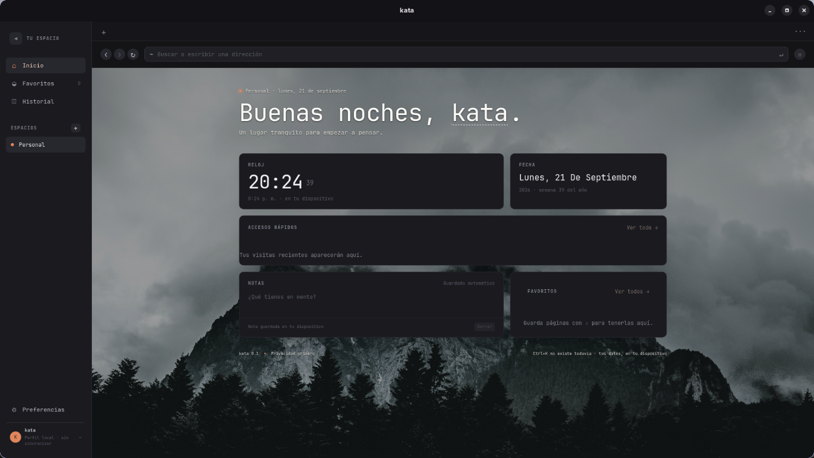
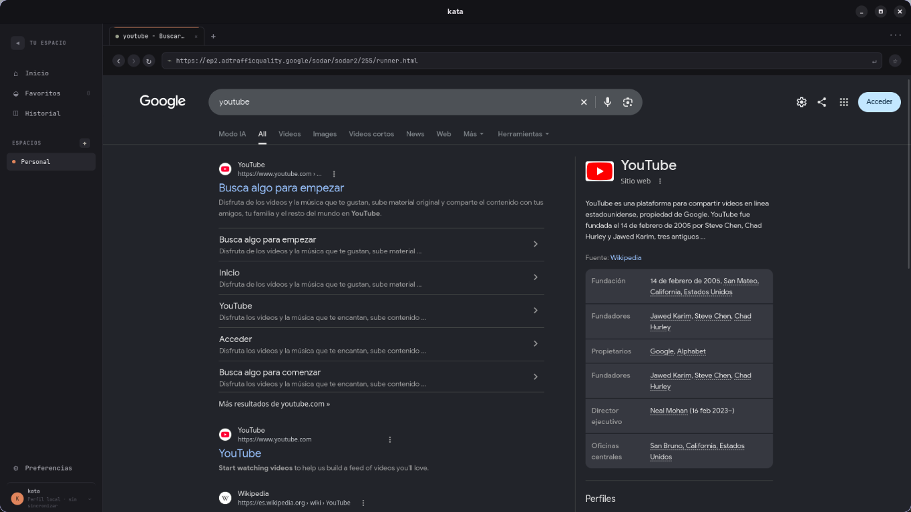

# kata

> Un navegador de escritorio local, privado y silencioso para Linux.

kata combina la flexibilidad de un navegador moderno con una interfaz ligera y
orientada a la privacidad. No requiere cuentas, no incluye telemetría y guarda
el estado de la aplicación en el dispositivo.



## Características principales

- **Pestañas nativas** con títulos reales, navegación atrás/adelante, recarga y
  zoom.
- **Espacios de trabajo** para separar contextos, incluido un espacio privado
  que no registra historial.
- **Barra de direcciones** con URLs directas, búsqueda configurable y
  sugerencias de historial y favoritos.
- **Inicio personalizable** con reloj, fecha, accesos rápidos, notas con
  autoguardado, favoritos y fondo propio.
- **Historial y favoritos locales**, con límite de 300 entradas para mantener
  el almacenamiento controlado.
- **Suspensión de pestañas inactivas** para reducir el uso de memoria, con
  dominios exentos configurables.
- **Cinco temas**: oscuro, claro, noche, mocha y nord.
- **Conmutador rápido** (`Ctrl+P`) para encontrar pestañas y espacios.
- **Persistencia segura** mediante escritura atómica y almacenamiento local.



## Tecnologías

- [Tauri 2](https://tauri.app/) y Rust para la aplicación de escritorio y los
  WebViews nativos.
- [React 19](https://react.dev/) y TypeScript para la interfaz.
- [Vite](https://vite.dev/) para el desarrollo y el empaquetado del frontend.
- WebKitGTK a través de Wry para renderizar las páginas en Linux.
- Parches locales de `tauri-runtime-wry` y `wry` para corregir el
  posicionamiento y el tamaño de WebViews en Linux/Wayland.

## Requisitos

- Linux con las dependencias de Tauri 2.
- Node.js 18 o superior y npm.
- Rust estable y Cargo.

En Debian o Ubuntu:

```bash
sudo apt install libwebkit2gtk-4.1-dev build-essential curl wget file \
  libxdo-dev libssl-dev libayatana-appindicator3-dev librsvg2-dev
```

## Desarrollo

```bash
npm install
npm run tauri dev
```

El frontend usa Vite con recarga en caliente. Los cambios en Rust requieren
recompilar la aplicación.

## Compilación

```bash
npm run build
npm run tauri build
```

Los instaladores se generan en
`src-tauri/target/release/bundle/` (por ejemplo, AppImage, DEB y RPM).


## Atajos esenciales

| Atajo | Acción |
| --- | --- |
| `Ctrl+T` | Nueva pestaña |
| `Ctrl+W` | Cerrar pestaña activa |
| `Ctrl+Shift+T` | Reabrir la última pestaña cerrada |
| `Ctrl+L` | Enfocar la barra de direcciones |
| `Ctrl+R` | Recargar la página |
| `Ctrl+D` | Guardar o quitar favorito |
| `Ctrl+P` | Conmutador rápido |
| `Ctrl+Tab` / `Ctrl+Shift+Tab` | Cambiar de pestaña |
| `Alt+←` / `Alt+→` | Atrás / adelante |
| `Ctrl+±` / `Ctrl+0` | Zoom |

## Privacidad y datos

El estado se guarda localmente en:

```text
~/.config/com.demon0.kata/kata-state.json
```

El fondo de inicio se almacena por separado para evitar reescribir archivos
grandes durante cada autoguardado. Los espacios privados no agregan entradas al
historial y kata no sincroniza tus datos con ningún servicio.

## Estructura

```text
src/                 # Interfaz React, estado y estilos
src-tauri/src/       # Comandos Rust y gestión de WebViews
src-tauri/vendor/    # Parches locales para Wry y Tauri Runtime
assets/screenshots/  # Capturas utilizadas en esta documentación
```

## Estado del proyecto

kata está en desarrollo activo. Algunas funciones avanzadas, como pestañas
ancladas, favicons, importación de favoritos y limpieza de cookies/caché,
permanecen en el roadmap.

## Licencia

Todavía no se ha definido una licencia. Uso personal y educativo por ahora.

---

Hecho con Tauri, Rust, React y TypeScript. Privacidad primero.
